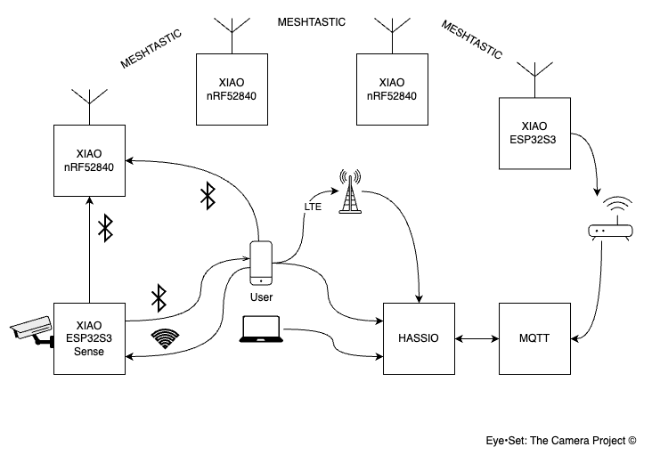

_A second pair of eyes for the wild._

**Eye•Set** is a mesh-connected camera trap system built for wildlife photographers and field researchers.

- 🔄 Real-time mesh sync
- 📸 Motion-triggered capture
- 📡 Works offline
- 🧠 AI-ready (optional models)

## More information:
<!-- [▶️ Live Demo](#) -->
